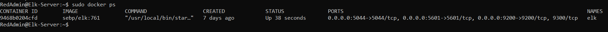

## Automated ELK Stack Deployment

The files in this repository were used to configure the network depicted below.

<figure><figcaption></figcaption></figure>

These files have been tested and used to generate a live ELK deployment on Azure. They can be used to either recreate the entire deployment pictured above. Alternatively, select portions of the install-elk.yml file may be used to install only certain pieces of it, such as Filebeat.

[ install-elk.yml ]

This document contains the following details:
- Description of the Topology
- Access Policies
- ELK Configuration
  - Beats in Use
  - Machines Being Monitored
- How to Use the Ansible Build

### Description of the Topology

The main purpose of this network is to expose a load-balanced and monitored instance of DVWA, the D*mn Vulnerable Web Application.

Load balancing ensures that the application will be highly available, in addition to restricting unwanted traffic to the network.
- A Load Balancer can insure availability for all servers by being evenly distributed
- A jump box is a single operating system, that is connected to two networks. The first of these networks is the common network and the second is the sensitive security zone.

Integrating an ELK server allows users to easily monitor the vulnerable VMs for changes to the log files and system metrics.
- Filebeat helps generate and organize files to send to Logstash and Elesticsearch. It specifially logs inforamiton about the file system, including which files hae chaneges and when.
- Metricbeat monitors the metrics of the DVWA virtual machines.

The configuration details of each machine may be found below:

| Name       | Function      | IP Address | Operating System          |  
|------------|---------------|------------|---------------------------|
| Jump Box   | Gateway       | 10.0.0.7   | Linux - Ubuntu 18.04-LTS  |
| Elk Server | Cloud Monitor | 10.1.0.4   | Linux - Ubuntu 18.04-LTS  |
| Web-1      | Web Server    | 10.0.0.5   | Linux - Ubuntu 18.04-LTS  |
| Web-2      | Web Server    | 10.0.0.6   | Linux - Ubuntu 18.04-LTS  |
| DVWA-VM3   | Web Server    | 10.0.0.1   | Linux - Ubuntu 18.04-LTS  |

### Access Policies

The machines on the internal network are not exposed to the public Internet. 

Only the Jumpbox, Elk Server and Load Balancer machine can accept connections from the Internet. Access to this machine is only allowed from the following IP addresses:
- Jumpbox (40.117.145.95)
- Elk Server (52.237.160.182)
- Load Balancer (40.121.135.134)

Machines within the network can only be accessed by my perosnal IP.
- Personal Laptop IP (71.201.212.82)

A summary of the access policies in place can be found in the table below.

| Name                           |  Publicly Accessible | Allowed IP Addresses              |
|--------------------------------|----------------------|-----------------------------------|
| Jump Box -   Port 22           | Yes                  | Personal IP address               |
| Elk Server - Port 5601         | Yes                  | 10.1.0.4                          |
| Web Server - Port 22           | No                   | 10.0.0.4                          |
| DVWA Load Balancer - Port 80   | Yes                  | 71.201.212.82 Local Home Network  |

### Elk Configuration

Ansible was used to automate configuration of the ELK machine. No configuration was performed manually, which is advantageous on saving time.

The playbook implements the following tasks:
- Install docker.io
- Install python3-pip
- Increase the virutual memory 
- Download and launch docker elk container
- Enable service docker on boot

The following screenshot displays the result of running `docker ps` after successfully configuring the ELK instance.

<figure><figcaption></figcaption></figure>

### Target Machines & Beats
This ELK server is configured to monitor the following machines:

| Name       |  IP Address |  
|------------|-------------|
| Web-1      |  10.0.0.5   | 
| Web-2      |  10.1.0.6   | 
| Web-3      |  10.1.0.1   | 

We have installed the following Beats on these machines:
- Filebeat
- Metricbeat

These Beats allow us to collect log files from very specific files such as those generated by Apache, Microsoft Azure tools, the Nginx web server and MySQL.

### Using the Playbook
In order to use the playbook, you will need to have an Ansible control node already configured. Assuming you have such a control node provisioned: 

SSH into the control node and follow the steps below:
- Copy the `install-elk.yml` file to `/etc/ansible`.
- Update the `host` file to include updated IP on lines `1106` amd `1806` inside the `filebeats_config.yml` file
- Run the playbook, and navigate to the `Kibana Server` to check that the installation worked as expected. 
- http://52.237.160.182:5601/app/kibana

_TODO: Answer the following questions to fill in the blanks:_
- _Which file is the playbook? Where do you copy it?_
- _Which file do you update to make Ansible run the playbook on a specific machine? How do I specify which machine to install the ELK server on versus which to install Filebeat on?_
- To check that the ELK server is running?
